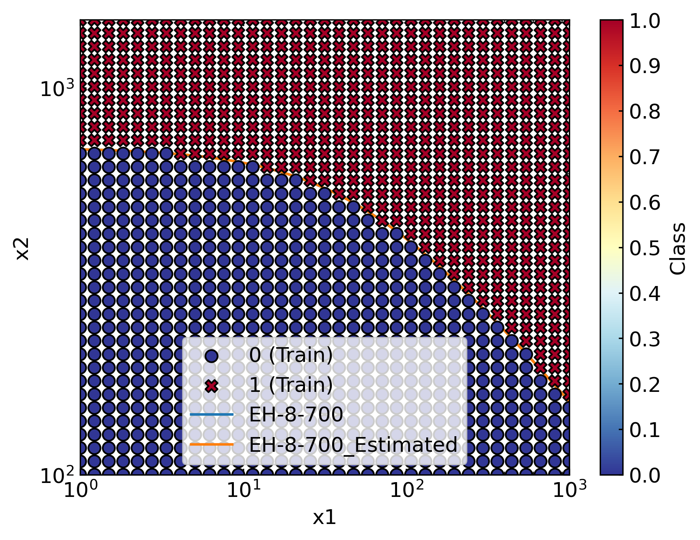
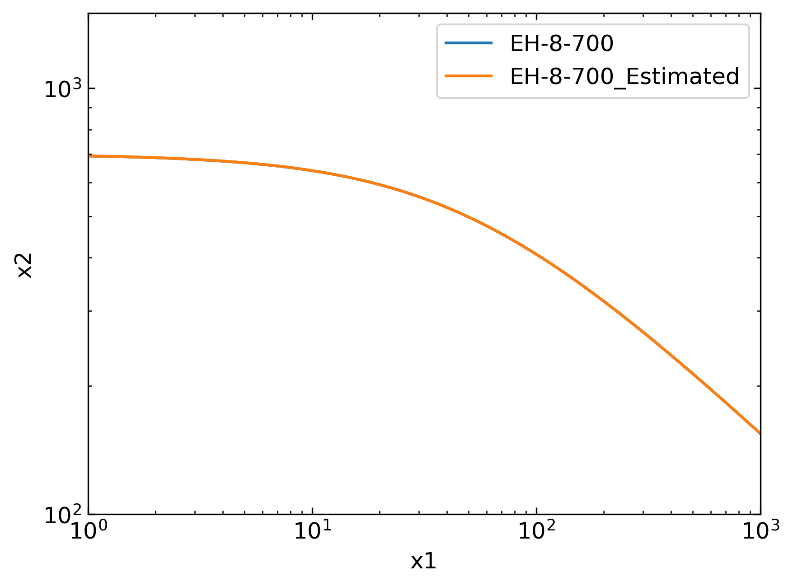

Scripts
=======
The enclosed script along with the config file serves the same purpose as the Jupyter Notebook presented in the prior section, though it allows for more automation and possible batch computations.

To run the script, just do:

.. code-block:: bash

    python eh_shell.py --config eh_shell.yaml

Prior to delving into the code its worth commenting on the `.yaml` to `.py` translation. Initially, the `.py` script load and parse the `.yaml` configuration script by:

.. code-block:: python

    cfg = get_config_file(parse_arguments())

As mentioned earlier, `.yaml` files are interpreted as Python dictionary. Please bear in mind that the configuration script is *totally optional*. If you do not wish to utilise it, just key-in the desired values/strings/parameters where appropriate. In order to intuitively catch how this configuration file works, let's analyse a few examples.

**Nested Directives.**  Please note that one can nest -- theoretically -- an indefinite number of directive levels. Nonetheless, the example uses only double nested directive to keep the configuration file manageable and easy to read. For instance, consider:

.. code-block:: python

    logger_manager(level=cfg["logger"]["level"])

this looks for the key ``logger`` and for the sub-key ``level`` in the ``.yaml`` script, which correspond to the following lines:

.. code-block:: yaml

    logger:
        level: WARNING

Without the configuration file:

.. code-block:: python
    
    logger_manager(level="WARNING") # for instance

**Unnested Directives.** Consider for instance:

.. code-block:: python

    sd = SyntheticDataset(name=cf["name"])

this looks for the key ``name`` directly:

.. code-block:: yaml

    name: aString

Without the configuration file:

.. code-block:: python
    
    sd = SyntheticDataset(name="aString")

Overview of the Script
----------------------

The script generates a regular training grid upon an El Haddad curve having :math:`\Delta K_{th,lc} = 8`, :math:`\Delta\sigma_w = {700}`, :math:`Y=0.9` (this values are arbitrarily taken). The script shall return the parameters of the curve that generated the dataset. In this instance, we should not prescribe priors, nor use a normalised log-likelihood.

The figures below display the results obtained, which are consistent with the hypothesised curve.

Please note that labels are generic as the processed dataset is not instantiated from ``ElHaddadDataset``. Importantly, we did not compute the predictive posterior as the estimation process just run Maximum Likelihood Estimation. Hence, the posterior is not envisaged in this framework.

Python Script
-------------

.. literalinclude:: ../_examples/eh_shell.py
    :language: python

Yaml Config Script
------------------

.. literalinclude:: ../_examples/eh_shell.yaml
    :language: yaml